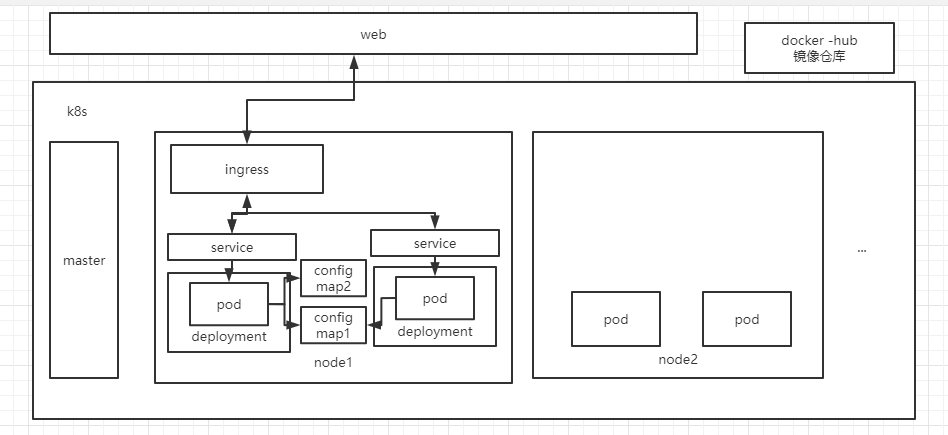

#1.资料说明
本功能只是用户k8s使用阶段，了解k8s相关的基本功能，其余功能还需要自行学习和查阅资料  
k8s 个人理解就是容器管理技术，负责容器的启动 停止 容错 等功能，对所有容器进行编排，而容器使用的则是docker工具来构建容器，如果不了解docker，请自行百度  
本文档 存个人学习经历，参考各种乱七八糟的文档 ，因此本文的存粹个人理解，有错就提，看到就改  


#2. 常用知识说明
pod  k8s的基础组件，pod 里面包含了镜像，可以是一个镜像 也可以是多个镜像，据说一个pod 中的镜像公用的同个网络，而镜像的挂载也是挂载在pod上面的。  
service 也叫svc ，个人理解，用于管理pod 对外网络服务，方便其他pod或者服务 访问pod中的网络，其实每个pod都有自己的网络，但是pod在重启后，网络会发生变化，而service绑定的是pod名字，所以通过service 即可以找到pod网络，即访问成功。  
deployment ，个人理解 就是管理pod的东西，涉及到 rc rs的功能，rc rs 可以自行百度，deployment 就是这个高级版本，创建一个deployment，他会按照需求实现pod的创建，而且及时删掉pod，deployment还存在，就会重新创建pod，因此会导致网络发生变化，所以要绑定一个service  
ingress 对外提供的 ，可以实现7层网络协议，可以绑定域名，提供访问，可以绑定service，外部即可以通过ingress 找到service，在通过service 访问到pod  
configMap 也可以 简称 cm 给pod提供配置文件，其实是给镜像提供的，有几种形式，其一是提供成为env 环境变量，一种是变成配置文件，其中以key-value形式，key就是文件名字，value是文件内容  
master k8s master 节点  
node k8s 上的 node 节点  
其他如果涉及在补充，了解以上 就可以构建一套 服务了， 下面提供一个概念图 。  



#3.k8s 常用命令
kubectl apply -f xxx.yaml    ###发布命令 可以发布 deployment service configmap ingress  
kubectl get pods                 ### 获取当前 node 工作空间下的所有 pod ，可以使用 grep 过滤  
kubectl get deployment      ### 获取工作空间下的所有 deployment  
kubectl get service 或者 kubectl get svc   ### 获取空间下面所有 service  
kubectl get configmap 或者 kubectl get cm  ### 获取空间下面的所有 configmap  
kubectl get ingress   ### 获取空间下面所有 ingress  
kubectl delete [pod | deployment | svc | cm]  name  ### 删除空间下面的对应名字的 pod /deployment / service/ configmap   
kubectl describe [pod | deployment | svc | cm] name   ### 查看空间下面对应名字的 pod/deployment /service /configmap  的详细细节  
kubectl logs podName  ###查看 pod 名字 的日志
kubectl exec -it podName -- /bin/bash  ###进入对应pod的容器中


#4.yaml 配置文件编写
##4.1 configmap.yaml  – configmap 配置文件写法 
```yaml
apiVersion: v1
kind: ConfigMap
metadata:
  name: analytics-nginx-config  # configMap 的名字
data:  #实际的数据 k-v 形式
  nginx.conf: "server {\n
                        listen       80;\n"
  heelo: "123456"
```

##4.2 service.yaml  serivce 配置文件写法
```yaml
apiVersion: v1
kind: Service
metadata:
  name: analytics-frontend-svc #service 名字
  namespace: eip-release   # 指定k8s 名称空间
spec:
  selector:
    app: analytics-frontend  #指定要绑定哪个pod上面 pod的名字
  ports:
    - protocol: TCP  //暴露出去的端口号
      port: 80
      name: analytics-frontend-svc-http-port-1
      targetPort: 80
    - protocol: TCP
      port: 443
      name: analytics-frontend-svc-http-port-2
      targetPort: 443
```

##4.3 ingress.yaml  写法样例
```yaml
apiVersion: networking.k8s.io/v1beta1
kind: Ingress
metadata:
  name: analytics-frontend-myapp  # ingress的名字
spec:
  tls:
    - hosts:
        - analytics-frontend-svc  # 要帮定的service名字 tls 指的 https 协议
      secretName: eip-tls-secret
  rules:
    - host: analytics.mlamp.cn
      http:
        paths:            #指定http 协议
          - path: /      #可以使用不同的 路径去跳转不同的service
            backend:
              serviceName: analytics-frontend-svc  #绑定的service 名字
              servicePort: 80  #暴露出去的端口号
```

##4.4  deployment.yaml 样例
```yaml
apiVersion: apps/v1
kind: Deployment
metadata:
  labels:
    app: analytics-frontend   #标签
  name: analytics-frontend-deployment  #deployment的名字
  namespace: "eip-release"  #k8s的名称空间
spec:
  replicas: 1  #副本数
  selector:
    matchLabels:
      app: analytics-frontend  # 标签的名字 前后呼应
  template:
    metadata:
      labels:
        app: analytics-frontend  #标签名字
    spec:                 #实际pod 形式
      imagePullSecrets:
        - name: eip-image-secret   # scrip 的名字 密钥相关
      containers:
        - name: lmx-test-fronted   #pod的名字
          image: reg.po.mlamp.cn/matrix/eip-release/components-dep/analytics-analytics-frontend-0.1:release  #镜像拉取地址
          imagePullPolicy: IfNotPresent  #拉取规则，如果镜像存在则不拉取 
          ports:
            - containerPort: 80   # 对外暴露的端口号
              protocol: TCP
          livenessProbe:    #存活检查 方式 ，如果检查失败，则删掉pod 重新启动
            httpGet:        # http 检查方式
              path: /       #请求路径
              port: 80      #请求端口
            initialDelaySeconds: 10  #启动后 多少秒后检查
            periodSeconds: 5         # 每5秒检查一次 
          volumeMounts:   # 需要挂载的 configmap  这里是作为文件形式，其中 name 为key  value 为文件内容
            - name: analytics-nginx-config
              mountPath: /etc/nginx/conf.d/
      volumes:
        - name: analytics-nginx-config  #挂载的 config map 和上面对应
          configMap:
            name: analytics-nginx-config
```


