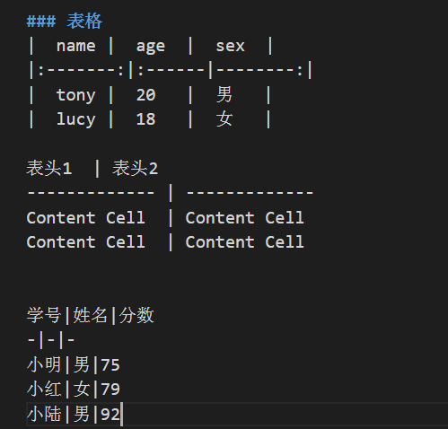

　　一般使用 # 来进行层级标识。共 6 个层级，再多不识别。

　　#  => h1;

　　## => h2;

　　### => h3;

　　#### => h4;

　　##### => h5;

　　###### => h6;

　　注：h1 级别会默认带一个 <hr/>

二、分隔线
　　至少三个 * 或 - 或 _ ，有空格也可以，不必连续。

三、换行
　　两个空格 + 一个回车。

代码
　　一行代码好像有简写，不过为了统一方便（偷懒，不想记），如下格式：

1
2
3
4
5
```
code code code
    code code code
    code
```
　　即首尾各多行  ``` 

符号是 > ，引用里可以套引用，理论上无限嵌套。如：

1
2
3
4
5
> 一级
>> 二级
>>> 三级
>>>> 四级

六、强调
　　* 文本1 * 或 _ 文本1 _ 　　斜体；

　　** 文本2 ** 或者 __ 文本2 __ 　　加重强调；

　　*** 文本3 *** 或者 ___ 文本3 ___ 　　特别强调；

七、链接
　　格式：[页面文字](链接地址)，如：[百度](https://www.baidu.com/)；

　　但是，md 中链接不支持 _blank，所以个人的写法还是直接写成： <a href="www.baidu.com" target="_blank">百度xx</a> ；

八、列表
　　有序列表（注意，' . ' 后面要跟一个空格）：

1. xxxx
2. xxxxx
3. xxxx
　　无序列表（注意，' * ' 后面要跟一个空格）：

* xxxx
* xxxx
* xxxxx
　　也支持嵌套，使用时在嵌套列表前按 tab 或 空格 来缩进,去控制列表的层数。

 九、图片
　　和 链接 类似，格式：   。

十、表格
  
