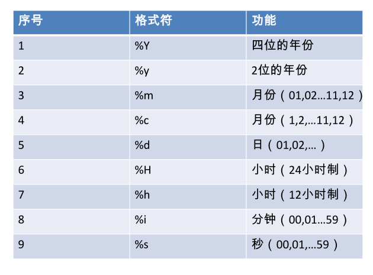
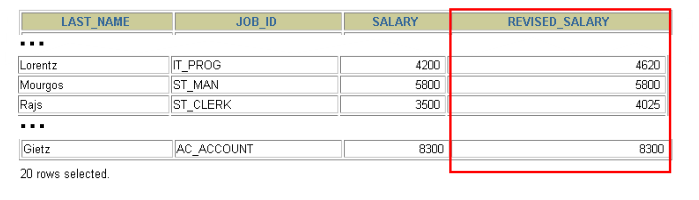

# 常见函数
    1. 字符函数
    2. 数学函数
    3. 日期函数
    4. 其他函数【补充】
    5. 流程控制函数【补充】
    
## 字符函数

### 大小写控制函数
    改变字符串的大小写
    1. LOWER
        LOWER('SQL Course') -> sql course
    2. UPPER
        UPPER('SQL Course') -> SQL COURSE

### 字符控制函数
    1. CONCAT
        拼接
        CONCAT('Hello', 'World') -> HelloWorld
    2. SUBSTR
        切割
        SUBSTR('HelloWorld', 1, 5) -> Hello
    3. LENGTH
        长度
        LENGTH('HelloWorld') -> 10
    4. INSTR
        查找第一个字符的下表
        INSTR('HelloWorld', 'W') -> 6
    5. LPAAD | RPAD
        LPAD - 填充字符串左边
        LPAD('salary', 10, '*') -> ****salary
        LPAD - 填充字符串右边边
        RPAD('salray', 10, '*') -> salary****
    6. TRIM
        默认删除前后空格
        删除指定首字符 如
        TRIM('H', FROM 'HelloWorld') -> elloWorld
    7. REPLACE
        替换
        REPLACE('abcd' , 'b' , 'm') -> amcd

### 数字函数
    1. ROUND
        四舍五入
        ROUND(45.926,2) -> 45.93
    2. TRUNCATE 
        截断
        TRUNC(45.926)   -> 45.92
    3. MOD
        求余
        MOD(1600, 300) -> 100
    
### 日期函数
    1. now
        获取当前日期
    
    2. str_to_date
        将日期格式的字符转换成指定格式的日期
        STR_TO_DATE('9-13-1999','%m-%d-%Y')  -> 1999-09-13
    
    3. date_format
        将日期转换成字符
        DATE_FORMAT(‘2018/6/6’,‘%Y 年%m 月%d 日’)  -> 2018 年06 月06 日

    4. 日期格式表

        
### 条件表达式
    1. sql 语句中使用 if-then-else 逻辑
    2.使用方法 
        -case 表达式
    
#### CASE表达式
    在需要使用 IF-THEN-ELSE 逻辑时:
     CASE expr WHEN comparison_expr1 THEN return_expr1
     [WHEN comparison_expr2 THEN return_expr2
     WHEN comparison_exprn THEN return_exprn
     ELSE else_expr]
     END      
     举例
```sql
SELECT last_name, job_id, salary,
CASE job_id WHEN 'IT_PROG' THEN 1.10*salary
WHEN 'ST_CLERK' THEN 1.15*salary
WHEN 'SA_REP' THEN 1.20*salary
ELSE salary END "REVISED_SALARY"
FROM employees;
```


#数据处理-增删改

## 数据操作语言
    DML 数据操纵语言 可以在下列条件下执行
    1. 向表中插入数据
    2. 修改现存的数据
    3. 删除现存的数据
    事务是由完成若干项工作的DML语句组成的
    
## 插入数据
    INSERT 语句语法
    INSERT INTO table [(column [, column...])]
    VALUES (value [, value...]);
    
 #插入数据：
    1. 为每一列添加新值
    2. 按列的默认顺序列出各个列的值
    3. 在INSERT 子句中随意列出列名和他们的值
    4. 字符和日期数据硬包含在单引号中

```sql
INSERT INTO departments(department_id, department_name,
manager_id, location_id)
VALUES (70, 'Public Relations', 100, 1700);

INSERT INTO
employees(employee_id,last_name,email,hire_date,job_id)
VALUES (300,'Tom','tom@126.com',to_date('2012-3-21','yyyy-mm-dd'),SA_RAP);
```

##隐式方式： 在列名表中省略该列的值
```sql
INSERT INTO departments (department_id,
department_name )
VALUES (30, 'Purchasing');
```
##显示方式： 在values 子句中指定空值
    
```sql
INSERT INTO departments
VALUES (100, 'Finance', NULL, NULL);
```

## 插入指定的列
    1.使用now()函数，记录当前系统的日期和时间
```sql
INSERT INTO employees (employee_id,
first_name, last_name,
email, phone_number,
hire_date, job_id, salary,
commission_pct, manager_id,
department_id)
VALUES (113,
'Louis', 'Popp',
'LPOPP', '515.124.4567',
NOW(), 'AC_ACCOUNT', 6900,
NULL, 205, 100);
```

## 从其他表中拷贝数据
```sql
INSERT INTO emp2
SELECT *
FROM employees
WHERE department_id = 90;

INSERT INTO sales_reps(id, name, salary, commission_pct)
SELECT employee_id, last_name, salary, commission_pct
FROM employees
WHERE job_id LIKE '%REP%';
```
    不用书写 values 子句
    子查询中的值列表应与 insert 子句中的列名对应

## 插入的几种方法

### insert into
    insert into表示插入数据，数据库会检查主键（PrimaryKey），如果出现重复会报错；

### replace into
    表示插入替换数据，需求表中有PrimaryKey，或者unique索引的话，如果数据库已经存在数据，则用新数据替换，如果没有数据效果则和insert into一样；

### insert ignore
    如果中已经存在相同的记录，则忽略当前新数据；

##更新数据
     使用 UPDATE 语句更新数据。
     UPDATE table
     SET column = value [, column = value, ...]
     [WHERE  condition];
     可以一次更新多条数据
     如果需要回滚数据，需要保证在DML前，进行
     设置：SET AUTOCOMMIT = FALSE;

## 使用where 子句指定需要更新的数据
```sql
UPDATE employees
SET department_id = 70
WHERE employee_id = 113;
```
## 如果省略 where 子句， 则表中的所有数据都将被更新
```sql
UPDATE  copy_emp
SET department_id = 110;
```

## 删除数据库
    使用 DELETE 语句从表中删除数据。
    DELETE FROM table
    [WHERE condition];

## 使用 WHERE 子句删除指定的记录。
```sql
DELETE FROM departments
WHERE department_name = 'Finance';
```

## 如果省略 WHERE 子句，则表中的全部数据将被删除
```sql
DELETE FROM copy_emp;
```


