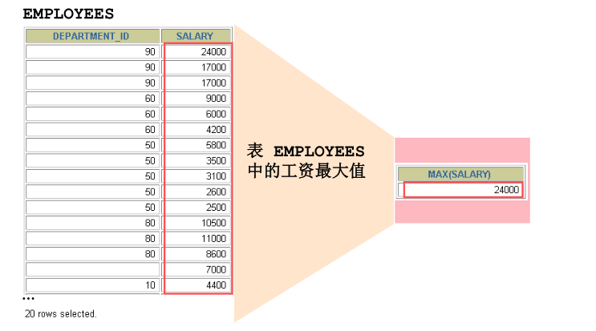
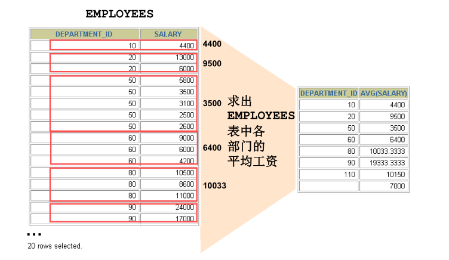
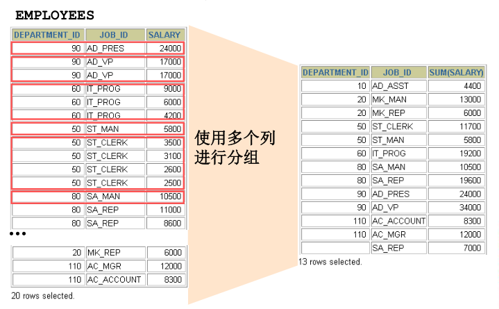
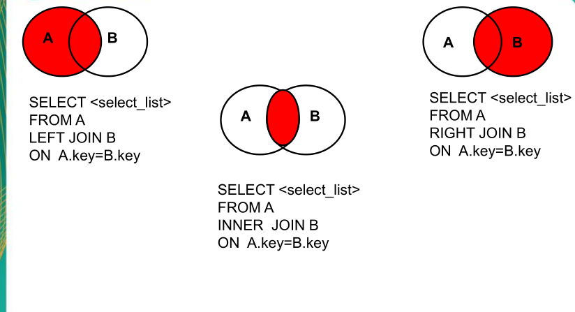
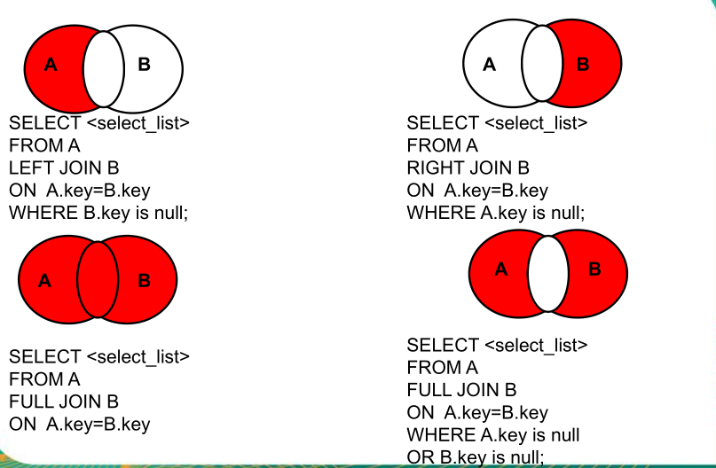

#mysql 基础

##为什么学习数据库
将重要的数据进行保存形式有多种，其中常用的是以内存或者硬盘的形式，而数据存储后的管理则使用数据库技术来实现

##数据库的相关概念
###DB
    数据库（database）： 存储数据的仓库，它保存了一系列有组织的数据
###DBMS
    数据库管理系统（database management system）。数据库是通过DBMS创建和操作的容器
### SQL
    结构化查询语言（structure query language），专门用来与数据库通信的语言

##SQL的优点
1. 不是某个特定数据库的语言，而是面向所有DBMS的语言
2. 简单易学
3. 虽然使用简单，但实际上是一种强有力的语言，灵活使用，可以实现很多高级和复杂的数据库操作

##SQL 语言的分类
1. DML 数据操作语句，用于添加、删除、修改、查询数据库记录，并检查数据的完整性
2. DDL 数据定义语句，用于数据库和表的创建，修改，删除
3. DCL 数据控制语句，用于定义用户的访问权限和安全级别

###DML
    DML 用于查询与修改数据记录，包括如下SQL语句：  
    INSERT 添加数据到数据库中
    UPDATE 修改数据库中的数据
    DELETE 删除数据库中的数据
    SELECT 选择（查询）数据

###DDL
    DDL 用于定义数据库的结构，比如创建，修改，删除数据库的对象，包括的sql 如下：
    CREATE TABLE 创建数据库表
    ALTER TABLE  修改数据库
    DROP TABLE   删除数据库
    CREATE INDEX 在表上建立索引
    DROP  INDEX  删除索引
    
###DCL
    DCL 用于控制数据库的访问，包括sql如下
    GRANT 授权访问权限
    REVOKE 撤销访问权限
    COMMIT 提交事务处理
    ROLLBACK 事务处理回退
    SAVEPOINT 设置保存点
    LOCK 对数据库的特定部分进行锁定

#Mysql 的数据库安装
    详细内容 -后期补充

## 安装后命令
    1. net start mysql 启动
    2. net stop mysql 停止
    3. mysql -u -p -h -P 登录 u 用户名， p 密码， h ip ， P 端口
    4. exit 退出

## 安装后重要配置文件
    my.ini 文件 其中可以修改 
    1. 服务的端口
    2. 数据存储磁盘位置
    3. 允许最大连接数
    4. 服务端使用的字符集默认为8比特编码的latin1字符集
    5. 创建新表时将使用的默认存储引擎

## mysql 的语法规范
    1. 不区分大小写
    2. 每句话都需要; 或者\g 结尾
    3. 各个子句 一般分行编写
    4. 关键字不能缩写 也不能分行
    5. 用缩进提高语言的可读性

## mysql 常用语句
    1. show databases 展示所有数据库
    2. show tables 展示所有表
    3. use database  数据库名  进入这个数据库
    4. create table student(id int, name varchar(200)); 创建一个表
    5. drop 表名 删除数据表
    6. desc 表名 查看表结构
    7. select * from 表名 查询所有记录
    8. insert into 表名 (列名) values (列值) 插入一条数据 
    9. update 表名 set 列1=新值   更新表中数据
    10. delete from 表名  删除表 数据
    11. 可以使用 where 进行过滤
    12. 在select 时可以指定要查询的列
    13. 运算符 可以使用 = > < between and 
    14. % 可以匹配多个字符
    15. _ 只匹配一个字符
    16 使用like 进行模糊查询
    17 is not null  不为空的数据
    18 order by 按顺序排列  ，如果使用desc 则是倒叙

#数据处理- 查询

##基本select 查询
```mysql
SELECT *|{[DISTINCT] column|expression [alias],...}
FROM table;
```
SELECT 标识选择哪些列
FROM 标识从哪个表中选择数据

### 选择全部查询
    select * from departments;
    
### 选择特定的列进行查询
    select id, user_name from user;
    
### 列的别名方式
    1. 重命名一个列
    2. 便于计算
    3. 紧跟列明， 也可以在列名和别名之间加入关键字 AS ，别名使用双引号，以便在别名中如果包含空格或特殊符号并区分大小写
    4. 举例
    select last_name as name from emplyees;
    
### 字符串查询
    1. 字符串可以是select 列表中的一个字符，数字，日期
    2. 日期和字符只能在单引号中出现
    3. 每当返回一行时， 字符串被输出一次

### 使用 describe 查询表结构 
    desc tableName
    
## 过滤和排序数据

### 过滤
    使用where 条件进行过滤
    SELECT *|{[DISTINCT] column|expression [alias],...}
    FROM table
    [WHERE condition(s)];

### where 子句
    1. 使用比较运算符 = > >= < <= != <>  age>10
    2. 其他比较运算符 between and , in , like , is null （空值）
    3. 逻辑运算符 AND OR NOT 
    4. ORDER BY 使用 order by 子句进行排序 
        ASE(ascend)： 升序
        DESC(descend): 降序
        ORDER BY 子句在select 语句的结尾

#组函数
    分组函数作用于一组数据，并对一组数据返回一个值
   
## 组函数类型
    1. AVG() 
        可以对数值类型使用
    2. COUNT()
        COUNT(*) 返回表中记录总数,适用于 任意数据类型
        COUNT(expr) 返回expr 不为空的记录总数 
    3. MAX()
        可以对任意数据类型使用
    4. MIN()
        可以对任意数据类型使用
    5. SUM()
        可以对数值类型使用
    
## 组函数语法
    SELECT [column,] group_function(column), ...
    FROM table
    [WHERE condition]
    [GROUP BY column]
    [ORDER BY column];

## 分组数据
   
   
## GROUP BY 子句语法
    1. 可以使用GROUP BY 子句将表中的数据分成若干组
    SELECT column, group_function(column)
    FROM table
    [WHERE condition]
    [GROUP BY group_by_expression]
    [ORDER BY column];

    2. 在SELECT  列表中所有未包含在组函数中的列都应该包含在 在 GROUP BY  子句中。
    SELECT department_id, AVG(salary)
    FROM employees
    GROUP BY department_id ;
    
    3.包含在 GROUP BY 子句中的列不必包含在SELECT 列表中
    SELECT AVG(salary)
    FROM employees
    GROUP BY department_id ;
    
## 使用多个列分组
   
    
    1.在group by 子句中包含多个列
    SELECT department_id dept_id, job_id, SUM(salary)
    FROM employees
    GROUP BY department_id, job_id ;
    
## 非法使用组函数
    1. 不能在 where 子句中使用组函数
    2. 可以在 having 子句中使用组函数
    
## 过滤分组 HAVING 子句
    使用HAVING 过滤分组
    1. 行已经被分组了
    2. 使用了组函数
    3. 满足HAVING子句中条件的分组将被显示
    SELECT column, group_function
    FROM table
    [WHERE condition]
    [GROUP BY group_by_expression]
    [HAVING group_condition]
    [ORDER BY column];


# 多表查询

##笛卡尔集
    笛卡尔集会在下面条件下产生
    - 胜率连接条件
    - 连接条件无效
    - 所有表中的所有行互相连接
    为了避免笛卡尔集 ，可以在 where 加如有效的连接条件
    
## MYSQL 连接
    使用连接在多个表中查询数据

    SELECT table1.column, table2.column
    FROM table1, table2
    WHERE table1.column1 = table2.column2;

     在  WHERE  子句中写入连接条件。
     在表中有相同列时，在列名之前加上表名前缀

## 等值连接
```sql
SELECT beauty.id,NAME,boyname FROM beauty ,boys
WHERE beauty.`boyfriend_id`=boys.id;
```

## 区别重复的列名
    1. 使用表名前缀在多个表中区分相同的列
    2. 在不同表中具有相同别名的列可以用 表的别名加以区分
    3. 如果使用了表别名， 则在select 语句中需要使用表别名代替表名
    4. 表别名最多支持32个字符长度，但建议越少越好
    
## 使用 ON 子句创建连接
    1. 自然连接中是以具有相同名字的列为连接条件
    2. 可以使用 ON 子句指定额外的连接条件
    3. 这个连接条件是与其它条件分开的
    4. ON 子句使语句具有更高的易读性
    
#JOIN 连接
    分类：
        1. 内连接（inner join）
        2. 外连接 
            左外连接 left join on
            右外连接 right join on
    join 连接总结

---



