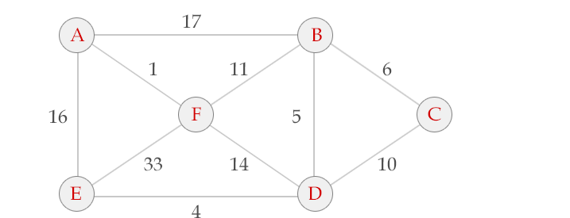

#1 基本概念
所谓贪心算法是指，在对问题求解时，<u>总是做出在当前看来是最好的选择</u>。也就是说，不从整体最优上加以考虑，它所做出的仅仅是在某种意义上的局部最优解。
贪心算法没有固定的算法框架，算法设计的关键是贪心策略的选择。必须注意的是，贪心算法不是对所有问题都能得到整体最优解，选择的贪心策略必须具备无后效性（即某个状态以后的过程不会影响以前的状态，只与当前状态有关。）  
所以，对所采用的贪心策略一定要仔细分析其是否满足无后效性。  
---
其实就是 把一个整体分成多段，每段之间不会有联系，这段中使用看似最优的算法来解决问题  
但是局部最优可能不是全部最优  

#2 贪心算法的基本思路
1. 建立数学模型来描述问题
2. 把求解的问题分成若干个子问题
3. 对每个子问题求解，得到子问题的局部最优解
4. 把子问题的解局部最优解合成原来问题的一个解

#3 该算法存在的问题
1. 不能保证求得的最后解是最佳的
2. 不能用来求最大值或最小值的问题
3. 只能求满足某些约束条件的可行解的范围

#4 贪心算法适用的问题
__贪心策略适用的前提是：局部最优策略能导致产生全局最优解。__
实际上，贪心算法适用的情况很少。一般对一个问题分析是否适用于贪心算法，可以先选择该问题下的几个实际数据进行分析，就可以做出判断。

#5 贪心选择性质
所谓贪心选择性质是指所求问题的整体最优解可以通过一系列局部最优的选择，
换句话说，当考虑做何种选择的时候，我们只考虑对当前问题最佳的选择而不考虑子问题的结果。
这是贪心算法可行的第一个基本要素。贪心算法以迭代的方式作出相继的贪心选择，每作一次贪心选择就将所求问题简化为规模更小的子问题。
对于一个具体问题，要确定它是否具有贪心选择性质，必须证明每一步所作的贪心选择最终导致问题的整体最优解。
  
当一个问题的最优解包含其子问题的最优解时，称此问题具有最优子结构性质。
问题的最优子结构性质是该问题可用贪心算法求解的关键特征。

#6 贪心算法的实现框架
从问题的某一初始解出发：  
while (朝给定总目标前进一步)   
{  
利用可行的决策，求出可行解的一个解元素。  
}  
由所有解元素组合成问题的一个可行解；  

#7 例题
【背包问题】有一个背包，容量是M=150，有7个物品，物品可以分割成任意大小。要求尽可能让装入背包中的物品总价值最大，但不能超过总容量。
物品：A B C D E F G
重量：35 30 60 50 40 10 25
价值：10 40 30 50 35 40 30

解：  
    1. 如果都取价格最贵的
    2. 如果取物品最小的
    3. 组合取数

 
Kruskal算法  
Kruskal算法的高效实现需要一种称作并查集的结构。我们在这里不介绍并查集，只介绍Kruskal算法的基本思想和证明，实现留在以后讨论。  

Kruskal算法的过程：  

（1） 将全部边按照权值由小到大排序。  
（2） 按顺序（边权由小到大的顺序）考虑每条边，只要这条边和我们已经选择的边不构成圈，就保留这条边，否则放弃这条边。  

算法 成功选择(n-1)条边后，形成一棵最小生成树，当然如果算法无法选择出(n-1)条边，则说明原图不连通。  
以下图为例：

