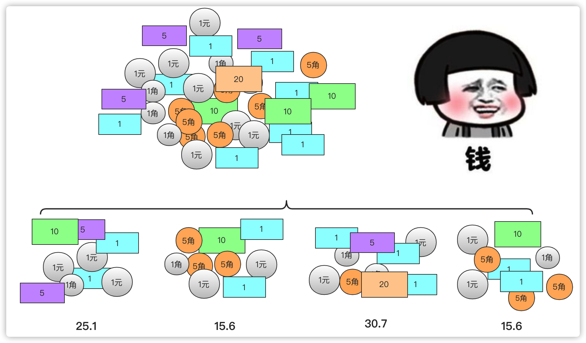
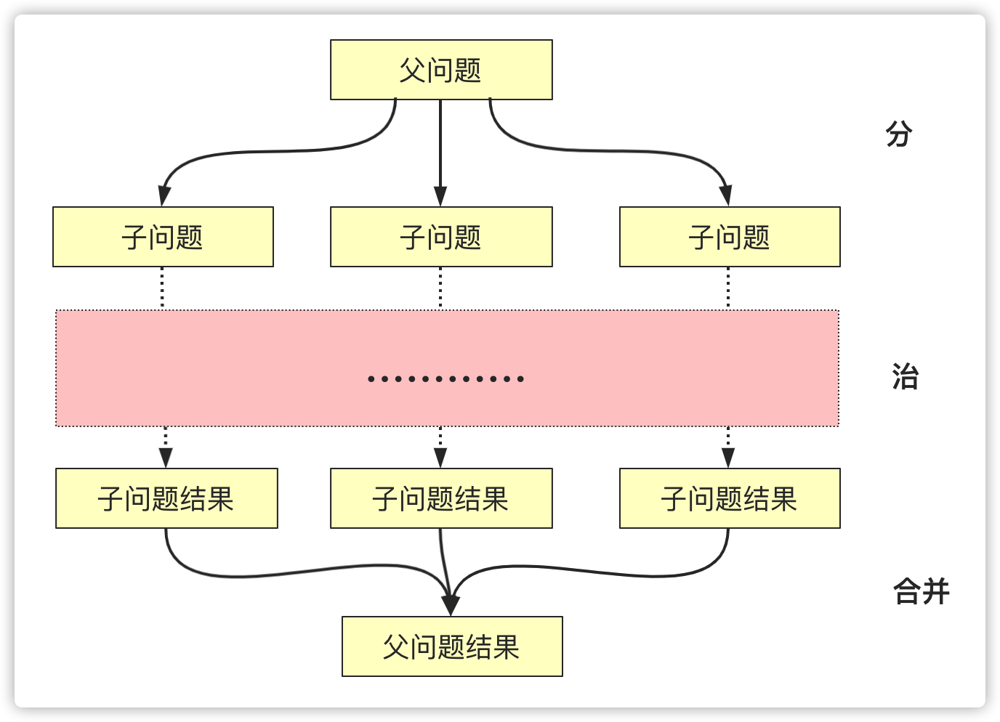

#1 分治算法（divide and conquer）
分治算法（divide and conquer）是五大常用算法(分治算法、动态规划算法、贪心算法、回溯法、分治界限法)之一，
很多人在平时学习中可能只是知道分治算法，但是可能并没有系统的学习分治算法，
本篇就带你较为全面的去认识和了解分治算法。  

在学习分治算法之前，问你一个问题，相信大家小时候都有存钱罐的经历，
父母亲人如果给钱都会往自己的宝藏中存钱，我们每隔一段时间都会清点清点钱。
但是一堆钱让你处理起来你可能觉得很复杂，因为数据相对于大脑有点庞大了，
并且很容易算错，你可能会将它先分成几个小份算，然后再叠加起来计算总和就获得这堆钱的总数了  




当然如果你觉得各个部分钱数量还是太大，你依然可以进行划分然后合并，我们之所以这么多是因为：  

计算每个小堆钱的方式和计算最大堆钱的方式是相同的(区别在于体量上)  
然后大堆钱总和其实就是小堆钱结果之和。这样其实就有一种分治的思想。  
当然这些钱都是想出来的……  

# 分治算法介绍
分治算法是用了分治思想的一种算法，什么是分治？  

分治，字面上的解释是“分而治之”，就是把一个复杂的问题分成两个或更多的相同或相似的子问题，
再把子问题分成更小的子问题……直到最后子问题可以简单的直接求解，原问题的解即子问题的解的合并。
在计算机科学中，分治法就是运用分治思想的一种很重要的算法。分治法是很多高效算法的基础，
如排序算法（快速排序，归并排序），傅立叶变换（快速傅立叶变换）等等。  

将父问题分解为子问题同等方式求解，这和递归的概念很吻合，所以在分治算法通常以递归的方式实现(当然也有非递归的实现方式)。
分治算法的描述从字面上也很容易理解，分、治其实还有个合并的过程：  

分(Divide)：递归解决较小的问题(到终止层或者可以解决的时候停下)  
治(Conquer)：递归求解，如果问题够小直接求解。  
合并(Combine)：将子问题的解构建父类问题  
一般分治算法在正文中分解为两个即以上的递归调用，并且子类问题一般是不想交的(互不影响)。
当求解一个问题规模很大很难直接求解，但是规模较小的时候问题很容易求解并且这个问题并且问题满足分治算法的适用条件，那么就可以使用分治算法。  



那么采用分治算法解决的问题需要 满足那些条件(特征) 呢?  

1. 原问题规模通常比较大，不易直接解决，但问题缩小到一定程度就能较容易的解决。

2. 问题可以分解为若干规模较小、求解方式相同(似)的子问题。且子问题之间求解是独立的互不影响。

3. 合并问题分解的子问题可以得到问题的解。

你可能会疑惑分治算法和递归有什么关系？其实分治重要的是一种思想，注重的是问题分、治、合并的过程
。而递归是一种方式(工具)，这种方式通过方法自己调用自己形成一个来回的过程，而分治可能就是利用了多次这样的来回过程。  

#分治算法经典问题
对于分治算法的经典问题，重要的是其思想，因为我们大部分借助递归去实现，所以在代码实现上大部分都是很简单，而本篇也重在讲述思想。

分治算法的经典问题，个人将它分成两大类：子问题完全独立和子问题不完全独立。

1. 子问题完全独立就是原问题的答案可完全由子问题的结果推出。
2. 子问题不完全独立，有些区间类的问题或者跨区间问题使用分治可能结果跨区间,在考虑问题的时候需要仔细借鉴下。

#二分搜索
二分搜索是分治的一个实例，只不过二分搜索有着自己的特殊性

1. 序列有序
2. 结果为一个值  
正常二分将一个完整的区间分成两个区间，两个区间本应单独找值然后确认结果，
但是通过有序的区间可以直接确定结果在那个区间，所以分的两个区间只需要计算其中一个区间
，然后继续进行一直到结束。实现方式有递归和非递归，但是非递归用的更多一些：
```shell script
public int searchInsert(int[] nums, int target) {
  if(nums[0]>=target)return 0;//剪枝
  if(nums[nums.length-1]==target)return nums.length-1;//剪枝
  if(nums[nums.length-1]<target)return nums.length;
  int left=0,right=nums.length-1;
  while (left<right) {
    int mid=(left+right)/2;
    if(nums[mid]==target)
      return mid;
    else if (nums[mid]>target) {
      right=mid;
    }
    else {
      left=mid+1;
    }
  }
  return left;
}
```
