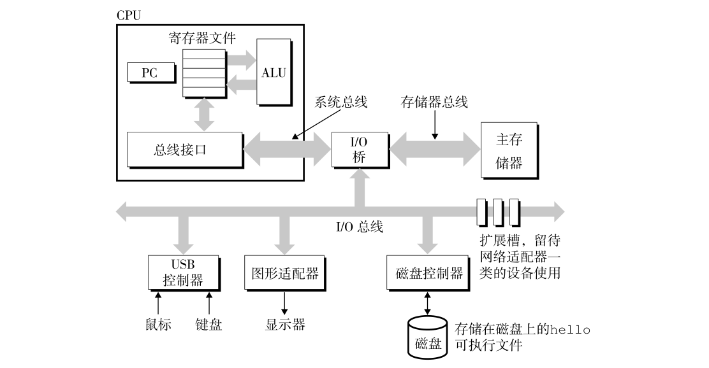

#第一章 计算机系统漫游

## 信息就是位 + 上下文
    一段程序要执行时，底层其实就是由0和1组成的位（bit）序列，8个位组织成一组，称为子节
    计算机所有的程序其实都是由 位构成的组 ，由多个子节构造而成
    
## 程序被其他程序翻译成不通的格式
    
## 了解编译系统如何工作是大有益处的
1. 优化程序
2. 理解链接时出现的错误
3. 避免安全漏洞

## 处理器读并解释存储在存储器中的指令

### 系统的硬件组成

1.总线
    贯穿整个系统的是一组电子管道，称作总线，它携带信息子节并负责在各个部件传递间传递。通常总线被设计成传送定长的字节块，
    也就是字。字总的字节数（字长）是一个基本系统参数，在各个系统中的情况都不尽相同。
    现在的大多数计算机机器字长有的是4个子节（32位），有的是8个子节（64位）。
    为了讨论方便，假设字长为4个子节，并且总线每次传递1个字
    
2. I/O设备
    输入/输出设备是系统与外部世界的联系通道。我们的演示系统包含4个I/O设备，输入的鼠标和键盘，
    输出的显示器，长期存储数据和程序的磁盘驱动  
    每个I/O设备都通过一个控制器或适配器与I/O总线相连。控制器和适配器之间的区别主要在于他们的封装方式。
    控制器是置于I/O设备本身的或者系统的主印制电路板（主板）上的芯片组，而适配器则是一个插在主板上插槽上的卡
    ，他们的功能都是在I/O总线和设备之间传递消息。

3. 主存
    主存是一个临时存储设备，在处理器执行程序时，用来存放程序和程序处理的数据。
    从物理上来说，主存是由一组动态最忌存取存储器(DRAM)芯片组成。从逻辑上来说，
    存储器是一个线性的字节数组，每个子节都有其唯一的地址，这些地址是从零开始的。
    
4. 处理器
    中央处理单元，简称处理器，是解释存储在主从中指令的引擎。处理器的核心是一个字长的存储设备，称为程序计数器。在任何时刻，PC都指向主存中的某条机器语言指令。
    处理器 常常处理 以下几种操作 加载、存储、操作、跳转

