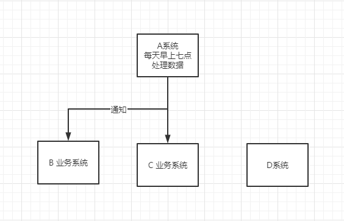
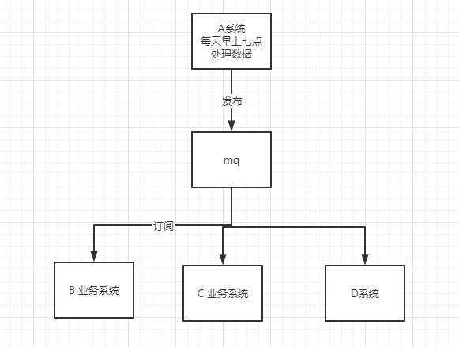
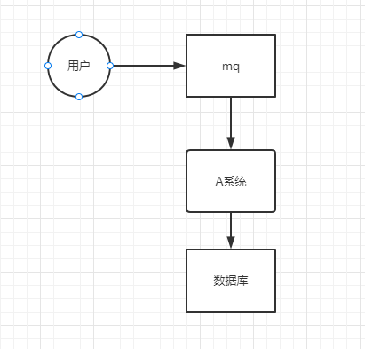

1. 为什么使用mq ？
    常见的mq 的主要作用用于： 解耦，肖锋，异步

解耦的常见场景：
    我们主要负责 A服务系统， 而B,C 系统是需要我们同步的系统，就是当我们要完成一个功能后要去告诉B,C 系统，常见的就是 每天更新数据，更新好后告诉B,C在进行下一步处理
    
    传统方式都是通过接口调取，就是 http的方式，A处理好后去调用B 和C 的服务，但是会出现一些问题，
    首先B,C服务可能挂掉，这就导致同步B,C的时候出现了问题，B,C的业务就阻塞了 或者我们多了一个 D 服务 也要这个数据，那么我们就还要增加调用D的接口
    那么我们可以让B和C 主动去拉A 的数据，但是这会消耗B,C的性能，因为一般轮询都是每10分钟这种场景，虽然这个方法可以解决 增加D的功能，但是D 也会同样面临B,C的情况
    因此 引入一个中间  消息队列的 方式，来解耦 B,C的关系，同样 如果 D 想要这个数据，同步订阅一下 这个消息队列就可以了，如果B 不想使用了，就取消订阅就可以了
    这样B,C的性能也不会影响，消息同步的时间也不会受到影响
    

异步的常见情景
    举个例子，比如用户 操作A服务，这个功能要同步在 B,C 服务同时写入，如果A写完之后，在给B写，在给C写，一个同步的过程 时间会消耗很久，这时就可以考虑一个异步操作
    同时往A,B,C 进行写入，这时就可以使用消息队列来实现，我们也可以使用异步线程机制来实现，但是我们这个就会形成一个木桶漏水的问题，时间消耗会是那个最大的时间
    如果我们对数据不是很精确来说的话，确实消息队列会好一些，因为她很快，我只要发送后，就直接返回客户成功即可，这里常见互联网要求返回时间都是 200ms以内

肖锋的常见场景：
    比如我们的服务平时都并发量很低 大概50 左右，但是某一段时间特别搞，比如搞个秒杀的活动，瞬间操作达到 5k 操作，而常规数据库支持 2k操作就基本够了，这种高峰的时候常见会直接把数据库打死
    所以我们可以使用mq 来解决这个问题，当然对于秒杀的常见还会引入 缓存+ 网关 以及一些算法，来保证我们的服务不蹦，达到一个缓慢的消费，这样高峰期过后，系统持续消费就可以把对接mq里的数据消费掉
    

2. 消息队列有什么优缺点：
    系统可用性降低，系统复杂性变高，一致性问题
    系统可用性降低
        因为本身就是多服务的场景，还需要引入mq的服务，如果mq的服务挂掉了，那么将会导致所有服务的瘫痪，因此要保证mq服务的高可用性
    系统的复杂性
        因为引入mq 就已经增加了服务的维护成本， 因此复杂性就随之变高了，同时还要维护mq的重复消费问题以及 顺序消费问题。
    一致性问题
        比如 A,B,C三个服务写入数据问题，A,B写入成功 C 失败，但是依然返回给用户操作成功，就是一个bug了

3. 常见的 几种 mq Kafka、ActiveMQ、RabbitMQ、RocketMQ 有什么优缺点？
|   特性  |   ActiveMQ    |   RabbitMQ    |   RocketMQ    |   kafka   |
|   ----|   ----|   ----|   ----|   ----|
|单机吞吐量|万级，比kafka和RocketMQ 低一个等级 | 同ActiveMQ| 10万级别，支持高吞吐 | 10万级别，高吞吐，一般用于大数据实时数据流以及日志采集工具|
|topic的数量对吞吐量的影响 | | | topic 达到几百、几千级别，会导致吞吐量的下降，在同等机器上，可以支撑大量的topic | 从几百 到几十的时候 就会导致吞吐量的下降，在同等机器下尽量避免topic的过多，如果想支持大量topic，建议增加机器
|时效性 | ms | 微妙级别， 是RabbitMQ 的特色 延迟最低| ms级别 | 在ms级别以内|
|可用性 | 高，基于主从结构实现的 |同ActiveMQ | 非常高，分布式架构 | 非常高，分布式数据，可以保证数据不丢|
|消息可靠性| 有效低的概率丢失数据| 基本不丢| 经过参数配置优化，可以保证 0 丢失| 同RocketMQ|
|功能支持 | MQ领域功能及其完备| 基于erlang开发，并发领域强，延迟低| MQ功能基本完善，分布式结构，扩展性好 | 功能略简单，只支持基本的MQ 功能，在大数据领域 使用度高一些

综上 推荐，ActiveMQ 目前使用率不高 社区也不够完善，基本放弃使用了
ActiveMQ 社区完善，但是 基于erlang 开发，如果在java领域 二次开发会很困难
RabbitMQ 阿里推荐 社区一般，但是java编写 已经贡献给apache 如果技术团队强大，可以使用并且进行 二开
kafka 大数据领域常用组件 社区活跃度高 

4. kafka 和 rocketmq对比
    kafka 大数据 高吞吐量 级别实际检测是要比 rocketmq 要强一个档次的，但是 会随着 topic 的增加 影响其性能，主要是因为他是 多主从备份导致的
    而 Rockemq 吞吐量 虽然不如 kafka 只对比 单topic来说，但是 rocketmq 是基于 commit的文件来写入数据的，他不会随着 topic 的增加 而影响性能，
    并且 rocketmq 还支持这些功能  RocketMQ 提供了丰富的消息检索功能、事务消息、消息消费重试、定时消息等 ，而kafka是不支持的
    所以 ，如果要是业务功能，比如 上面的 解耦 ，异步的场景，使用 rocketmq 是很好的

5. 如何保证 消息队列的高可用
    RabbitMQ 的高可用
        
